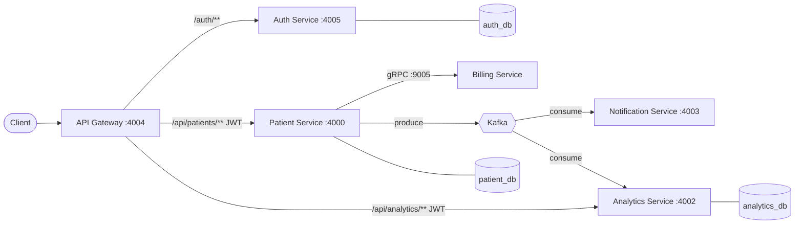

# Patient Management System

[](https://github.com/somensoni-behuria/patient-management-system/actions/workflows/ci.yml)

A production-style **microservices** patient management system built with **Java 21** and
**Spring Boot 3.5**. Services communicate over **REST**, **gRPC**, and **Kafka**, sit behind a
**Spring Cloud Gateway** with **JWT** auth, and ship with **Docker Compose**, an **AWS CDK**
infrastructure module (LocalStack), **Prometheus + Grafana** observability, and end-to-end
integration tests.

Design documents: **[docs/HLD.md](docs/HLD.md)** (high-level design) and
**[docs/LLD.md](docs/LLD.md)** (low-level design).

## Architecture



- **Billing** is internal (gRPC only) — no gateway route.
- **Notification** is internal (Kafka consumer) — no gateway route.
- **Analytics** both consumes events and serves a read-only query API through the gateway.

## Services & ports

| Service | Port(s) | Exposed via gateway | Datastore |
|---|---|---|---|
| api-gateway | 4004 | — (is the gateway) | — |
| auth-service | 4005 | `/auth/**` | Postgres `auth_db` |
| patient-service | 4000 | `/api/patients/**` (JWT) | Postgres `patient_db` |
| analytics-service | 4002 | `/api/analytics/**` (JWT, read-only) | Postgres `analytics_db` |
| billing-service | 9005 (gRPC), 4001 (actuator) | no | — |
| notification-service | 4003 | no | — |
| Kafka | 9092 (internal), 9094 (host) | — | — |
| Prometheus | 9090 | — | — |
| Grafana | 3000 | — | — |

## Prerequisites

- Docker + Docker Compose
- (For host builds/tests) Java 21 and Maven

## Run the whole stack

```bash
docker compose up --build
```

This starts 3 Postgres instances, Kafka, all 6 services, and Prometheus + Grafana, with
healthchecks and ordered startup. First build compiles every service (a few minutes).

### End-to-end smoke test

```bash
# 1) Log in through the gateway -> get a JWT
TOKEN=$(curl -s -X POST http://localhost:4004/auth/login \
  -H 'Content-Type: application/json' \
  -d '{"email":"testuser@test.com","password":"password123"}' | sed -E 's/.*"token":"([^"]+)".*/\1/')

# 2) Create a patient (triggers gRPC billing + Kafka event)
curl -s -X POST http://localhost:4004/api/patients \
  -H "Authorization: Bearer $TOKEN" -H 'Content-Type: application/json' \
  -d '{"name":"Grace Hopper","email":"grace@example.com","address":"1 Navy Yard","dateOfBirth":"1906-12-09","registeredDate":"2025-01-01"}'

# 3) List patients
curl -s http://localhost:4004/api/patients -H "Authorization: Bearer $TOKEN"

# 4) Analytics (populated by the Kafka consumer)
curl -s http://localhost:4004/api/analytics/summary -H "Authorization: Bearer $TOKEN"
```

Watch `docker compose logs -f billing-service notification-service analytics-service` to see the
gRPC billing account being created and the Kafka event consumed.

Ready-made requests are in [`api-requests/`](api-requests/) (`.http` files).

### Swagger UI

- Aggregated at the gateway: http://localhost:4004/swagger-ui.html
- Per service: `:4000`, `:4005`, `:4002` at `/swagger-ui.html`

### Observability

- Prometheus: http://localhost:9090
- Grafana: http://localhost:3000 (admin / admin) — the **Latency & Throughput** dashboard shows
  request rate and **p99/p95 latency** per service.

## Build & test on the host

```bash
mvn -q -DskipTests package     # build all services
mvn -q test                    # run unit tests
```

Integration tests (need the stack running) are gated behind a profile:

```bash
mvn -q verify -pl integration-tests -Pintegration     # after docker compose up
```

## Infrastructure as code (AWS CDK -> LocalStack)

The [`infrastructure/`](infrastructure/) module is a standalone AWS CDK (Java) app that
provisions a VPC, RDS Postgres instances, an MSK (Kafka) cluster, and ECS/Fargate services.

```bash
cd infrastructure
./localstack-deploy.sh          # requires LocalStack + aws-cdk-local; MSK/ECS need LocalStack Pro
```

Docker Compose is the primary, always-works local path; the CDK stack is the
infrastructure-as-code reference (see [docs/HLD.md](docs/HLD.md) → Deployment).

## Project layout

```
patient-management-system/
├── api-gateway/           Spring Cloud Gateway + JWT filter
├── auth-service/          JWT issue/validate, seeded user (Postgres)
├── patient-service/       Patient CRUD, gRPC client, Kafka producer (Postgres)
├── billing-service/       Internal gRPC server
├── notification-service/  Kafka consumer
├── analytics-service/     Kafka consumer + read-only query API (Postgres)
├── infrastructure/        AWS CDK app (LocalStack)
├── integration-tests/     REST-assured end-to-end tests
├── observability/         Prometheus + Grafana config
├── api-requests/          Sample .http requests
├── docs/                  HLD.md, LLD.md, BUILD_PLAN.md
└── docker-compose.yml
```
