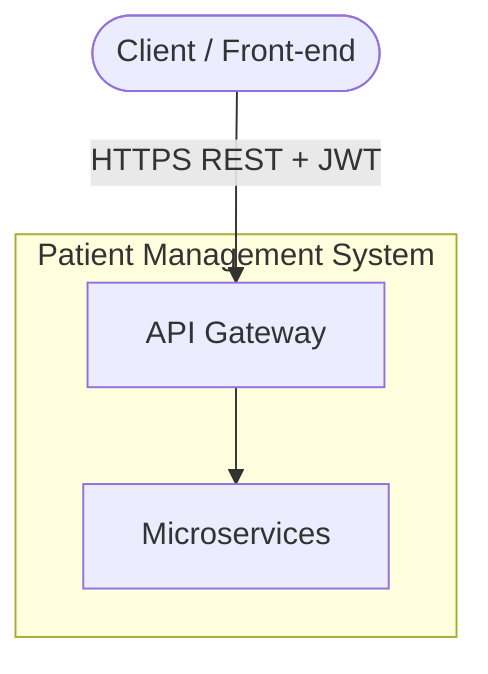
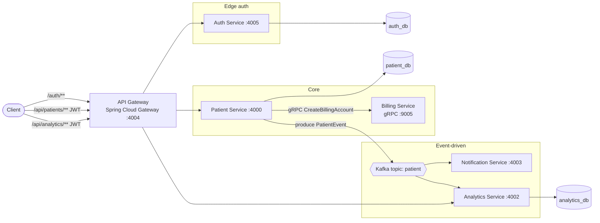
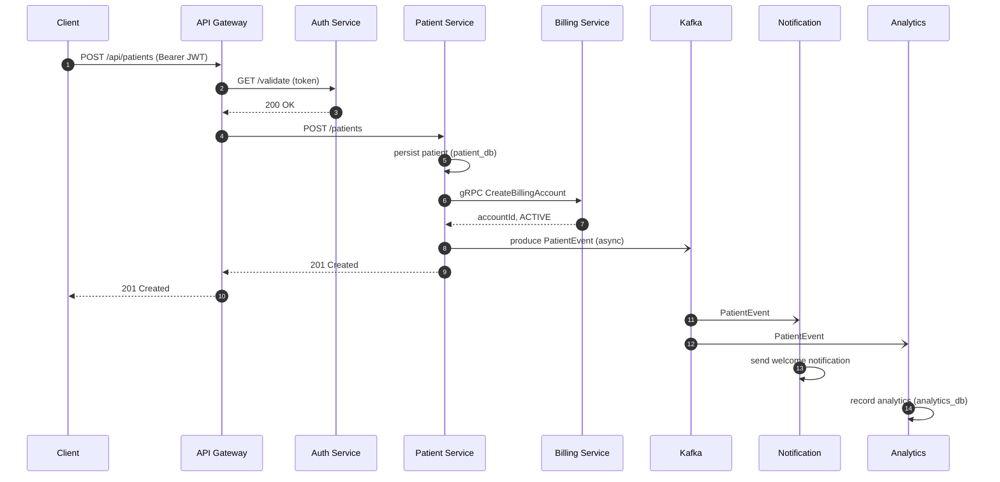
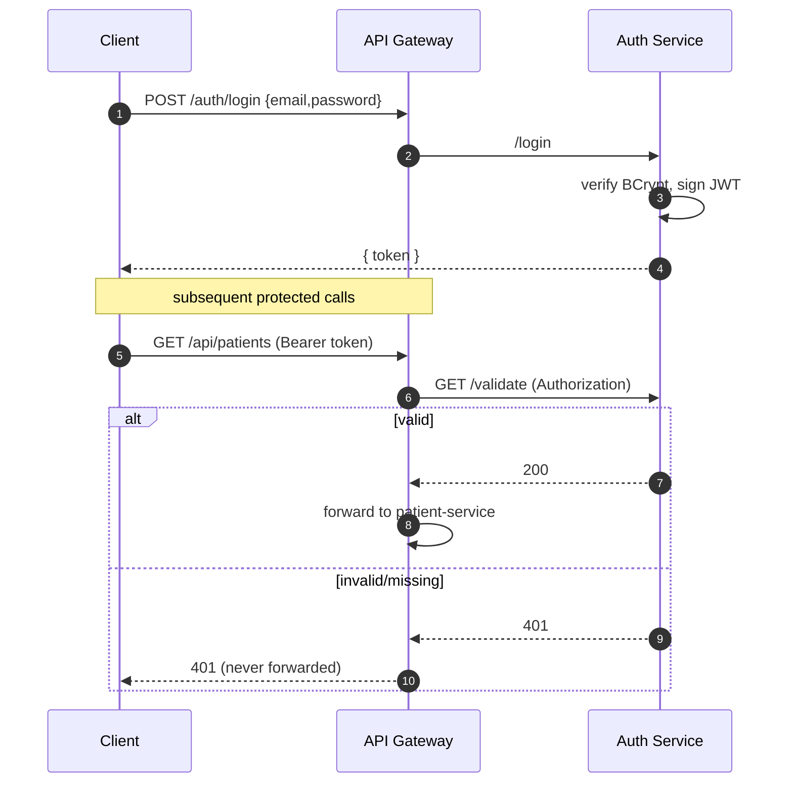
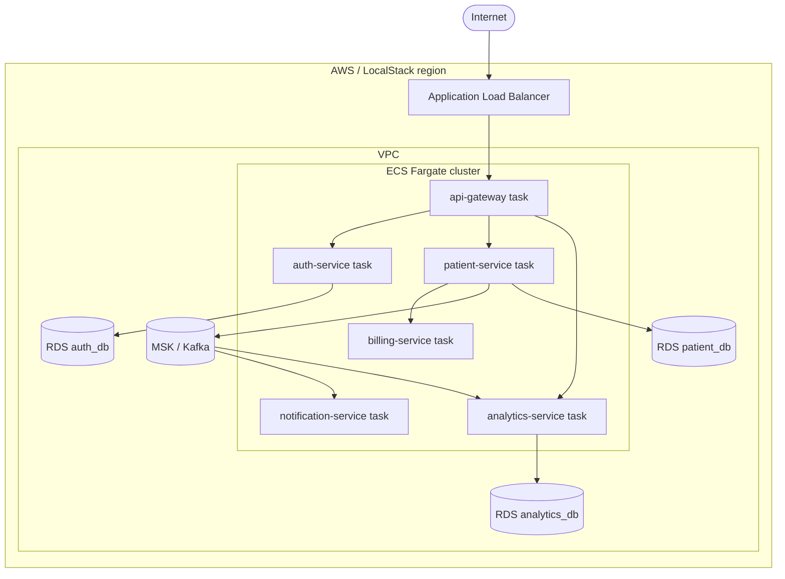
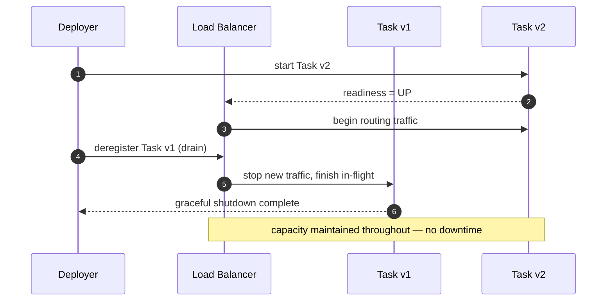
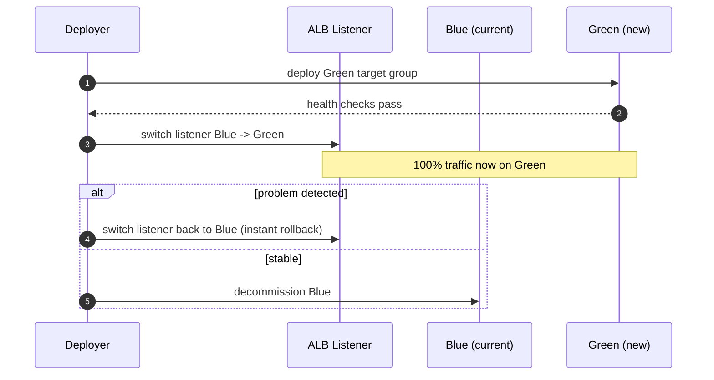
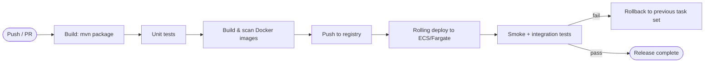
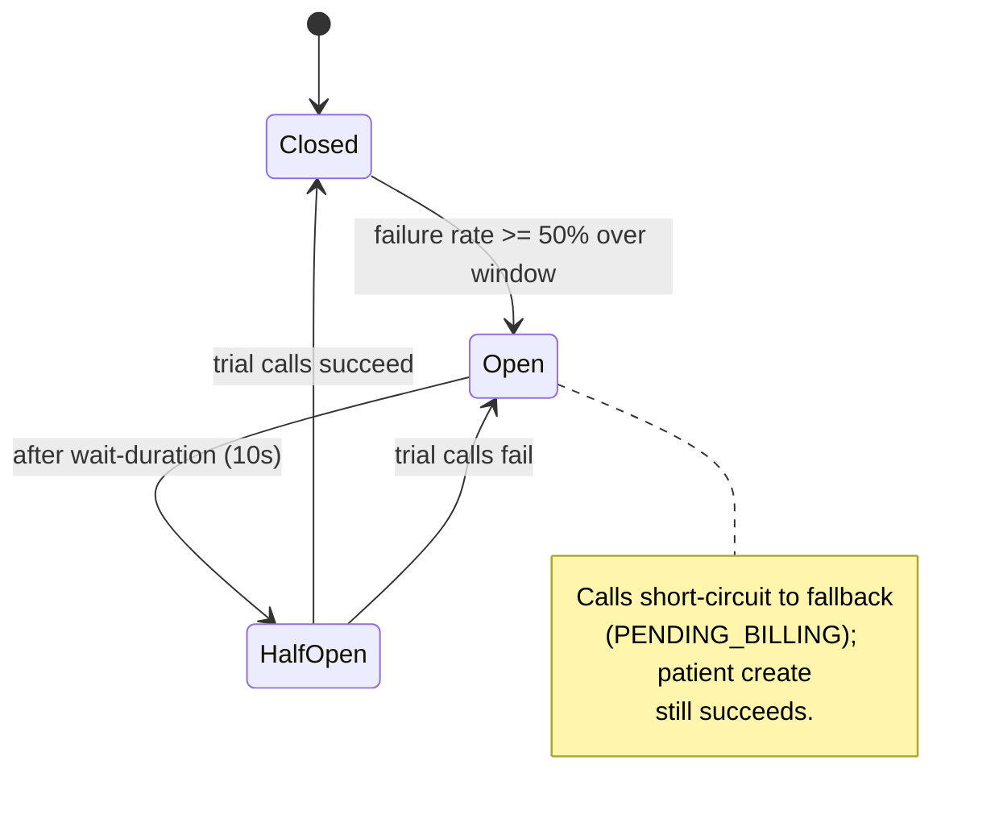

# High-Level Design (HLD) — Patient Management System

## 1. Introduction

The Patient Management System is a microservices application for registering and managing
patients. Creating a patient also opens a billing account and emits an event that downstream
services react to (notifications, analytics). The system is designed to be **horizontally
scalable**, **independently deployable per service**, and **operable with zero-downtime
deployments** under a defined latency budget.

### 1.1 Goals

- Clean service boundaries with a database-per-service data model.
- A single authenticated entrypoint (API gateway + JWT).
- Mixed communication styles chosen per interaction: REST (external), gRPC (low-latency internal
  command), Kafka (asynchronous fan-out).
- Production concerns first-class: health probes, graceful shutdown, metrics/tracing, resilience,
  and a documented deployment and rollback strategy.

### 1.2 Non-goals

- A production payment integration (billing is simulated).
- A real notification channel (notifications are logged).
- Multi-region/DR topology (single-region reference).

## 2. Requirements

### 2.1 Functional

- Authenticate users and issue JWTs; validate them at the edge.
- CRUD patients; enforce unique email.
- On patient creation: create a billing account (synchronous) and publish a `PATIENT_CREATED`
  event (asynchronous).
- Consume patient events to (a) send a welcome notification and (b) record analytics.
- Serve read-only analytics aggregates to authenticated clients.

### 2.2 Non-functional (SLOs)

| Concern | Target |
|---|---|
| Availability | No dropped requests during a normal deploy (zero-downtime) |
| Latency — reads | p99 < 200 ms |
| Latency — patient create (end-to-end via gateway) | p99 < 400 ms |
| Recovery | A single service/task failure must not fail the create flow (graceful degradation) |
| Observability | p99 latency and error rate measurable per service |

## 3. System context



The client only ever talks to the API gateway. All internal services are private.

## 4. Container diagram



## 5. Service catalog

| Service | Responsibility | Inbound | Outbound | Data |
|---|---|---|---|---|
| api-gateway | Routing, JWT validation, Swagger aggregation | REST (client) | REST (auth/patient/analytics) | none |
| auth-service | Issue/validate JWT, user store | REST | — | `auth_db` |
| patient-service | Patient CRUD, orchestrate side effects | REST | gRPC (billing), Kafka (produce) | `patient_db` |
| billing-service | Create billing accounts | gRPC | — | none (simulated) |
| notification-service | Send welcome notifications | Kafka | — | none |
| analytics-service | Record events, serve aggregates | Kafka + REST | — | `analytics_db` |

## 6. Communication patterns

- **REST (synchronous, external):** client ⇆ gateway ⇆ services. Human-facing, cacheable,
  well-supported by tooling and Swagger.
- **gRPC (synchronous, internal):** patient → billing. Chosen for a low-latency, strongly-typed
  request/response command on the critical create path. Protobuf contract in
  [`billing_service.proto`].
- **Kafka (asynchronous, internal):** patient → {notification, analytics}. Chosen to decouple
  side effects from the request path so a slow/absent consumer never blocks patient creation, and
  to allow independent scaling and replay. Protobuf-encoded `PatientEvent`.

### 6.1 Create-patient sequence



## 7. Data ownership

Each service owns its database; no service reads another's schema directly. Cross-service data
flows only through APIs and events. This keeps services independently deployable and schema
changes local.

## 8. Security & authentication

- Passwords stored as **BCrypt** hashes.
- Login returns a signed **HS256 JWT** (subject = email, `role` claim).
- The gateway's `JwtValidation` filter calls auth-service `/validate` for protected routes and
  rejects with 401 before forwarding.



## 9. Cross-cutting concerns

- **Configuration:** environment variables per service (see the config matrix in the LLD),
  defaulted for local runs in `docker-compose.yml`.
- **API docs:** each service exposes OpenAPI/Swagger; the gateway aggregates them.
- **Logging:** structured SLF4J logging with correlation via Micrometer observation tags.
- **Observability:** Micrometer → Prometheus metrics and OpenTelemetry-ready traces; Prometheus +
  Grafana are wired into `docker-compose` with a p99/throughput dashboard.
- **Resilience:** Resilience4j retry + circuit breaker on the patient→billing gRPC call, with a
  graceful fallback.

## 10. Deployment topology

Docker Compose is the primary local runtime. For infrastructure-as-code, the `infrastructure`
module (AWS CDK, deployed to LocalStack) provisions the cloud topology:



Services register in a Cloud Map namespace (`patient-management.local`) for DNS-based discovery;
the ALB fronts only the gateway.

## 11. Zero-downtime deployment

**Default strategy: rolling deployment** (per service, one task at a time), with **blue-green**
documented as the opt-in path for the gateway/patient-service where instant rollback is desired.

Zero-downtime is achieved by:

- **Readiness/liveness probes** (Spring Boot Actuator). The load balancer/orchestrator only sends
  traffic to `READY` tasks and drains old ones first.
- **Graceful shutdown** (`server.shutdown=graceful` + a shutdown timeout) so in-flight requests
  complete before a task stops; the platform drains connections.
- **Backward-compatible (expand/contract) DB migrations** so old and new versions run against the
  same schema during the rollout.
- **Kafka consumer groups** — partitions rebalance across restarting instances with no lost
  events; producers are idempotent and retried.
- **gRPC deadlines + retry** so a billing task restart doesn't fail patient creation.

### 11.1 Rolling deployment



### 11.2 Blue-green (opt-in)



## 12. CI/CD pipeline



## 13. Performance & p99 latency budget

The create-patient path is the tightest budget. Target end-to-end **p99 < 400 ms**:

| Hop | Operation | p99 budget |
|---|---|---|
| Gateway | routing + JWT validate (cached path) | 40 ms |
| Gateway → Patient | network + deserialization | 20 ms |
| Patient | persist patient (DB write) | 120 ms |
| Patient → Billing | gRPC CreateBillingAccount | 120 ms |
| Patient → Kafka | async produce (off the response path) | ~0 ms (fire-and-forget) |
| Serialization/response | build + return 201 | 60 ms |
| **Total (synchronous path)** | | **≈ 360 ms** |

Read paths (list/get patient, analytics) target **p99 < 200 ms** — a single service hop plus one
DB read.

How the budget is held:

- **Resilience4j timeouts** cap the billing gRPC call so a slow dependency can't blow the budget;
  the circuit breaker sheds load and the fallback returns a `PENDING_BILLING` status.
- **Async Kafka** keeps notifications/analytics entirely off the response path.
- **Horizontal autoscaling** (ECS target-tracking on CPU / request count) adds capacity under load.
- **Prometheus histogram buckets** (`http_server_requests_seconds_bucket`) + Grafana measure the
  actual p99 continuously.

## 14. Resilience — circuit breaker states



## 15. Scalability & trade-offs

- **Database-per-service** enables independent scaling and deployment at the cost of no cross-
  service joins (resolved via events/APIs).
- **gRPC on the critical path** gives low latency and a typed contract but couples patient→billing
  availability; mitigated with timeouts, retry, circuit breaker, and a fallback.
- **Kafka for fan-out** decouples side effects and enables replay/back-pressure, at the cost of
  eventual consistency for notifications and analytics.
- **Gateway as a single entrypoint** centralizes auth and routing but must itself be scaled and
  deployed with zero downtime (hence blue-green as an option there).

## 16. Technology stack

| Concern | Choice |
|---|---|
| Language / runtime | Java 21 |
| Framework | Spring Boot 3.5 |
| Gateway | Spring Cloud Gateway (2025.0.x) |
| Sync internal RPC | gRPC 1.69 + Protobuf 4.29 |
| Async messaging | Apache Kafka (Spring Kafka) |
| Persistence | PostgreSQL 16 + Spring Data JPA |
| AuthN | Spring Security + JJWT (HS256) |
| Resilience | Resilience4j |
| API docs | springdoc-openapi (Swagger UI) |
| Metrics | Micrometer + Prometheus + Grafana |
| Containerization | Docker (multi-stage), Docker Compose |
| IaC | AWS CDK (Java) on LocalStack |
| Testing | JUnit 5, Mockito, REST-assured |
```
