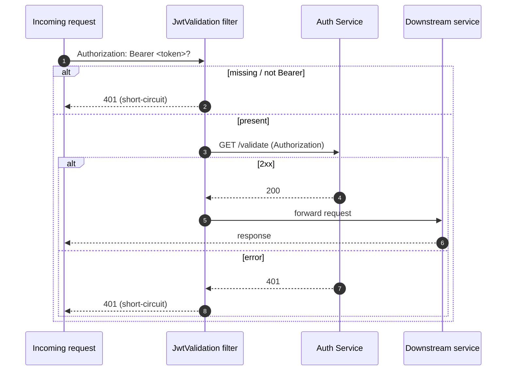
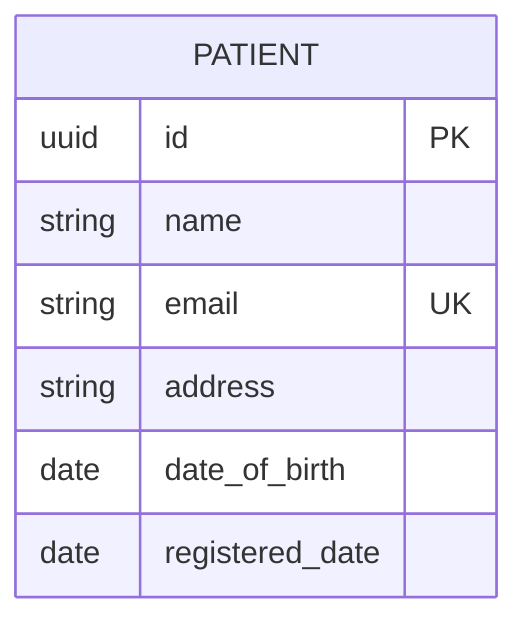
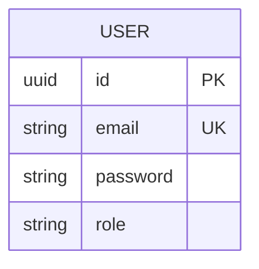
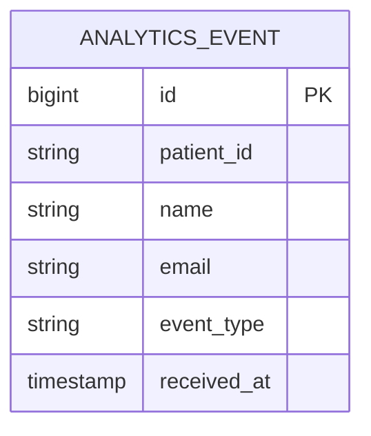

# Low-Level Design (LLD) — Patient Management System

Companion to [HLD.md](HLD.md). This document specifies the internal design of each service:
package structure, classes, endpoints, DTOs, database schemas, contracts (gRPC/Kafka),
configuration, and error handling.

## 1. Conventions

- Group id / base package: `com.pm.<service>` (e.g. `com.pm.patient`).
- Layering per service: `controller` → `service` → `repository`/`grpc`/`kafka`; `model`
  (JPA entities), `dto`, `mapper`, `config`, `exception`.
- Build: Maven multi-module (parent `com.pm:patient-management-system`); each service is a Spring
  Boot app packaged as an executable jar and a multi-stage Docker image (JRE 21 runtime).
- Ports: gateway 4004, patient 4000, billing 4001/gRPC 9005, analytics 4002, notification 4003,
  auth 4005.

## 2. auth-service

**Package `com.pm.auth`** — `AuthServiceApplication`, `controller.AuthController`,
`service.AuthService`, `repository.UserRepository`, `model.User`, `dto.LoginRequestDTO`,
`dto.LoginResponseDTO`, `util.JwtUtil`, `config.SecurityConfig`, `config.DataLoader`,
`config.OpenApiConfig`.

### Endpoints (service-local; gateway prefix `/auth` is stripped)

| Method | Path | Body | Success | Failure |
|---|---|---|---|---|
| POST | `/login` | `LoginRequestDTO` | 200 `{ token }` | 401 (bad credentials), 400 (validation) |
| GET | `/validate` | — (header `Authorization: Bearer …`) | 200 | 401 (missing/invalid/expired) |

### DTOs

- `LoginRequestDTO`: `email` (`@Email`, required), `password` (required, min 8).
- `LoginResponseDTO`: `token` (String).

### JWT (HS256)

- Header: `{ alg: HS256, typ: JWT }`.
- Claims: `sub` = email, `role` (e.g. `ADMIN`), `iat`, `exp` (default 10 h).
- Secret: base64-encoded, ≥ 256-bit, from `JWT_SECRET`. Verified in `JwtUtil.validateToken`
  (throws `JwtException` on failure).

### Security

`SecurityConfig`: CSRF disabled, stateless sessions, all endpoints `permitAll` (auth-service does
not guard downstream resources); `BCryptPasswordEncoder` bean for password hashing. `DataLoader`
seeds one admin user (default `testuser@test.com` / `password123`, override via
`AUTH_SEED_EMAIL` / `AUTH_SEED_PASSWORD`) when absent.

## 3. patient-service

**Package `com.pm.patient`** — `PatientController`, `service.PatientService`,
`repository.PatientRepository`, `model.Patient`, `dto.PatientRequestDTO`,
`dto.PatientResponseDTO`, `dto.validators.CreatePatientValidationGroup`, `mapper.PatientMapper`,
`grpc.BillingServiceGrpcClient`, `kafka.KafkaProducer`, `exception.*`, `config.*`.

### Endpoints (gateway prefix `/api/patients` stripped → `/patients`)

| Method | Path | Body | Success | Failure |
|---|---|---|---|---|
| GET | `/patients` | — | 200 `[PatientResponseDTO]` | — |
| GET | `/patients/{id}` | — | 200 `PatientResponseDTO` | 404 |
| POST | `/patients` | `PatientRequestDTO` (create group) | 201 `PatientResponseDTO` | 400, 409 (email) |
| PUT | `/patients/{id}` | `PatientRequestDTO` (default group) | 200 `PatientResponseDTO` | 400, 404, 409 |
| DELETE | `/patients/{id}` | — | 204 | 404 |

### Validation groups

`CreatePatientValidationGroup` makes `registeredDate` required only on create; other constraints
(`name`, `email`, `address`, `dateOfBirth`) apply to both create and update via the `Default`
group.

### Side effects on create (in `PatientService.createPatient`)

1. Persist `Patient` (unique email enforced; else `EmailAlreadyExistsException` → 409).
2. `BillingServiceGrpcClient.createBillingAccount(...)` — gRPC, guarded by Resilience4j.
3. `KafkaProducer.sendPatientCreatedEvent(...)` — async publish of `PatientEvent`.

### Resilience config (`billingService` instance)

| Property | Value |
|---|---|
| retry max-attempts | 3 |
| retry wait-duration | 200 ms |
| circuit sliding-window | 10 |
| failure-rate-threshold | 50% |
| wait-in-open-state | 10 s |
| fallback | return `PENDING_BILLING` (create still succeeds) |

## 4. billing-service

**Package `com.pm.billing`** — `BillingServiceApplication`, `grpc.BillingGrpcService`
(extends generated `BillingServiceImplBase`). Internal gRPC only (port 9005); actuator on 4001.

- `createBillingAccount(BillingRequest)` → `BillingResponse { account_id, status="ACTIVE" }`.
- No database (simulated); logs each request/response.

## 5. notification-service

**Package `com.pm.notification`** — `kafka.KafkaConsumer` with
`@KafkaListener(topics="patient", groupId="notification-service")`. Deserializes `PatientEvent`
(Protobuf) and logs a welcome notification. No datastore, no gateway route.

## 6. analytics-service (consumer + read API)

**Package `com.pm.analytics`** — `kafka.KafkaConsumer`, `service.AnalyticsService`,
`repository.AnalyticsEventRepository`, `model.AnalyticsEvent`, `dto.AnalyticsSummaryDTO`,
`controller.AnalyticsController`, `config.OpenApiConfig`.

> **Extension note:** the analytics query API and its `analytics_db` store go beyond a pure
> Kafka-consumer analytics service; they were added so clients can read aggregates through the
> gateway.

### Consumer

`@KafkaListener(topics="patient", groupId="analytics-service")` → `AnalyticsService.record()`
persists an `AnalyticsEvent`.

### Endpoints (gateway prefix `/api/analytics` stripped → `/analytics`; read-only, JWT-protected)

| Method | Path | Success |
|---|---|---|
| GET | `/analytics/summary` | 200 `{ totalEvents, patientsCreated }` |
| GET | `/analytics/patients/count` | 200 `{ patientsCreated }` |

## 7. api-gateway

**Package `com.pm.apigateway`** — `ApiGatewayApplication`,
`filter.JwtValidationGatewayFilterFactory` (extends `AbstractGatewayFilterFactory`; filter name
`JwtValidation`). Reactive (WebFlux) Spring Cloud Gateway.

### Routes (`spring.cloud.gateway.server.webflux.routes`)

| id | Predicate | Target | Filters |
|---|---|---|---|
| auth-service-route | `Path=/auth/**` | auth-service:4005 | StripPrefix=1 |
| patient-service-route | `Path=/api/patients/**` | patient-service:4000 | StripPrefix=1, JwtValidation |
| analytics-service-route | `Path=/api/analytics/**` | analytics-service:4002 | StripPrefix=1, JwtValidation |
| patient-service-api-docs | `Path=/api-docs/patients` | patient-service:4000 | RewritePath → `/v3/api-docs` |
| auth-service-api-docs | `Path=/api-docs/auth` | auth-service:4005 | RewritePath → `/v3/api-docs` |
| analytics-service-api-docs | `Path=/api-docs/analytics` | analytics-service:4002 | RewritePath → `/v3/api-docs` |

### JwtValidation filter



## 8. Data model (ERDs)

Each entity lives in its own service database.







## 9. Contracts

### 9.1 gRPC — `billing_service.proto`

```
service BillingService {
  rpc CreateBillingAccount (BillingRequest) returns (BillingResponse);
}
```

| Message | Field | Type | # |
|---|---|---|---|
| BillingRequest | patient_id | string | 1 |
| | name | string | 2 |
| | email | string | 3 |
| BillingResponse | account_id | string | 1 |
| | status | string | 2 |

The proto is duplicated in `billing-service` (server) and `patient-service` (client); both
generate from it via `protobuf-maven-plugin`. Keep the two copies in sync.

### 9.2 Kafka — `patient_event.proto` (topic `patient`)

| Field | Type | # | Notes |
|---|---|---|---|
| patient_id | string | 1 | |
| name | string | 2 | |
| email | string | 3 | |
| event_type | string | 4 | e.g. `PATIENT_CREATED` |

Value serialization: Protobuf `toByteArray()` (producer) / `parseFrom()` (consumers). Producer is
idempotent with `acks=all` and retries; consumers use distinct group ids
(`notification-service`, `analytics-service`) so each receives every event.

## 10. Configuration matrix (environment variables)

| Variable | Services | Default (local) |
|---|---|---|
| `SPRING_DATASOURCE_URL/USERNAME/PASSWORD` | auth, patient, analytics | per-service Postgres |
| `SPRING_KAFKA_BOOTSTRAP_SERVERS` | patient, notification, analytics | `kafka:9092` |
| `BILLING_SERVICE_HOST` / `BILLING_SERVICE_GRPC_PORT` | patient | `billing-service` / `9005` |
| `JWT_SECRET` / `JWT_EXPIRATION_MS` | auth | dev base64 secret / 36000000 |
| `AUTH_SEED_EMAIL` / `AUTH_SEED_PASSWORD` | auth | `testuser@test.com` / `password123` |
| `AUTH_SERVICE_URL` / `PATIENT_SERVICE_URL` / `ANALYTICS_SERVICE_URL` | api-gateway | service DNS |

All services enable Actuator `health` (readiness/liveness probes), `info`, and `prometheus`, plus
`server.shutdown=graceful`.

## 11. Error handling

`patient-service` `GlobalExceptionHandler` (`@RestControllerAdvice`):

| Exception | HTTP | Body |
|---|---|---|
| `MethodArgumentNotValidException` | 400 | `{ field: message }` |
| `EmailAlreadyExistsException` | 409 | `{ message }` |
| `PatientNotFoundException` | 404 | `{ message }` |

auth-service returns 401 for bad credentials / invalid tokens and 400 for malformed login bodies.

## 12. Build & packaging

- Multi-stage Docker per service: `maven:3.9-eclipse-temurin-21` build stage (runs
  `mvn -pl <module> -am -DskipTests package`) → `eclipse-temurin:21-jre` runtime (non-root user,
  `curl` for healthchecks).
- gRPC/Protobuf services use `os-maven-plugin` + `protobuf-maven-plugin` to generate stubs.
- Integration tests run under the `integration` Maven profile only (they need the live stack).

## 13. CDK resource mapping (infrastructure module)

| Code (`LocalStack.java`) | AWS resource |
|---|---|
| `createVpc()` | VPC (2 AZs, no NAT) |
| `createDatabase()` ×3 | RDS PostgreSQL (auth/patient/analytics) |
| `createMskCluster()` | MSK cluster (Kafka) |
| `createEcsCluster()` | ECS cluster + Cloud Map namespace |
| `createFargateService()` | Fargate task def + service per microservice |
| gateway service | Public entrypoint (ALB-frontable) |

## 14. Testing

- **Unit:** `JwtUtilTest` (auth), `PatientMapperTest` (patient), `AnalyticsServiceTest`
  (analytics, Mockito).
- **Integration:** `PatientManagementIT` (REST-assured) drives login → create patient → fetch →
  unauthorized-check through the gateway; run with `mvn verify -pl integration-tests -Pintegration`
  against a running stack.
```
